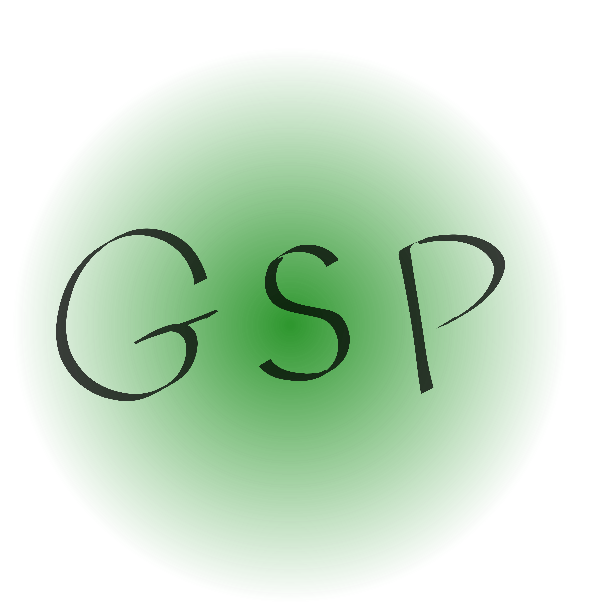

    

# Supported games
Currently GSP supports only Minecraft Java edition and Minecraft Bedrock edition but i want to add a lot of games! :D
I'm going to add lots of games like Terraria, Rust etc. I also want to create a plugin system to add support for other games

# Dependencies
- [MongoDB](https://docs.mongodb.com/manual/tutorial/install-mongodb-on-debian/)
- [Docker](https://www.docker.com/)

# How to install 
See [https://game-server-panel.github.io/docs/install/ubuntu/](https://game-server-panel.github.io/docs/install/ubuntu/)

or 

use the installer in the installer/ folder

# TODO:
- [x] Container filesystem reader
- [x] Create new container from frontend
- [x] Login system 
- [x] Design a logo
- [ ] Add more games (Terraria, Rust, etc.)

# Known issues
- ~~Login not working~~ [Solved]
- ~~CLI not working with Minecraft Bedrock edition~~ [Solved]
- ~~Filemanager download is very bad (I'm searching a better way)~~ [Solved]

# Contributors 
- [Superredstone](https://github.com/Superredstone) I am currently working alone but other contributors are welcome! :D